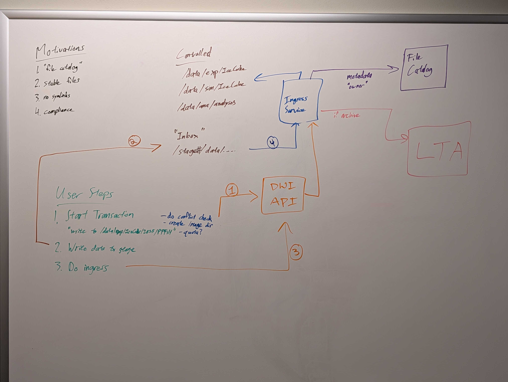

# data-warehouse-ingest

Data warehouse ingestion services.

## Citadel

Controls the protected data areas of the data warehouse. This is a backend
service that should not be called by users.

Some available operations:
1. Create a temporary inbox for new data.
2. Move data from an inbox into a protected area.
3. Delete / cleanup an inbox.
4. Inform a file catalog of the newly controlled files.
5. Inform the Long Term Archive of new data that should be archived.

## Barbican

A user frontend for writing files to the Citadel.

MVP: An API allowing limited operations:

| Method | Path | Description |
| ------ | ---- | ----------- |
| `POST` | `/api/v1/inbox` | Create a new  inbox |
| `GET`  | `/api/v1/inbox/[id]` | Get info on inbox |
| `DELETE` | `/api/v1/inbox/[id]` | Delete inbox |
| `POST` | `/api/v1/inbox/[id]/publish` | Publish inbox to data warehouse |

### Creating an Inbox

Creating an inbox takes various parameters:

* Final data warehouse path
* Estimated size
* Expected lifetime of inbox
* Should data be archived via LTA?
  * If so, which sites to archive the data at 

Additional metadata may be added here in the future.

> Note: if an existing inbox exists for the specified data warehouse path,
> the new request will be rejected.

### Using an Inbox

Once an inbox has been created, files can be uploaded to it via normal methods.

An inbox is exclusive to a single user, and will not allow group writes.

### Publishing an Inbox

When all data has been uploaded to an inbox and it is ready to be moved into
the data warehouse, the publish action will instruct the Citadel to proceed.
This will lock the inbox while publishing, then delete the inbox.
